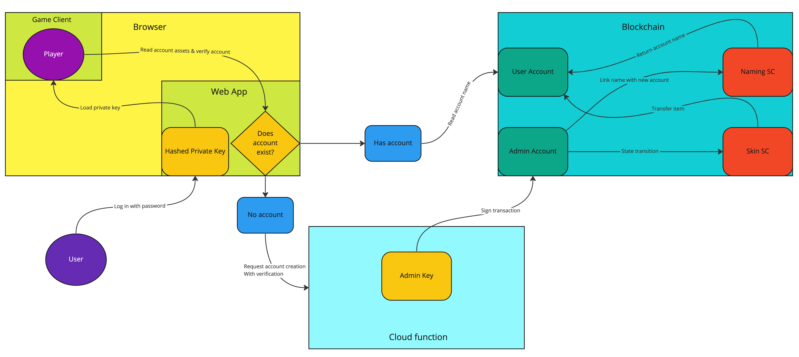

# Witch One P2P Name Service

This repository contains the code for Witch One's P2P name service.

## What is the P2P Name?

Currently, Witch One uses a P2P networking system to create the multiplayer experience.
Great thing about a P2P system is that it is always available as long as there is a peer to connect to, albeit with varying network performance.

However, in a P2P network, you cannot have a reliable multi-client information that all players can view, as there is no way to determine what is the "correct" information when there is no central authority in a P2P environment.
For example, you cannot have a reliable naming system or character skins that is tied to your account that other people can look.
This is especially true for payment systems or premium skins.
How can you have a reliable way to send player-specific information if everyone in a P2P network can spoof their information?

This is where the P2P Name Service comes to play.
The premise is simple, we use a reference server to feed all clients with the player-tied information, so that names and skins will be propagated through all P2P clients.
A good example is Minecraft's custom skins for paid users.

But unlike most system, we will use a blockchain as the reference server.
This means that both the game and the player identity is completely P2P, effectively making Witch One a game that can last forever.

## System Architecture

We have three components in this system:

- Game client
- Admin server
- Blockchain (smart contract)

The admin server is a centralized system that can issue new names to user accounts.
However, once the name is issued, the admin has no involvement and everything will be done between the game client and the blockchain.
